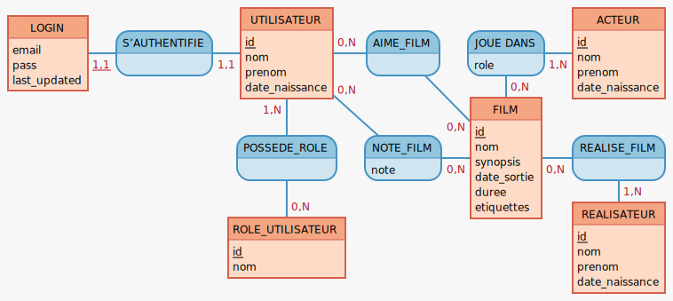
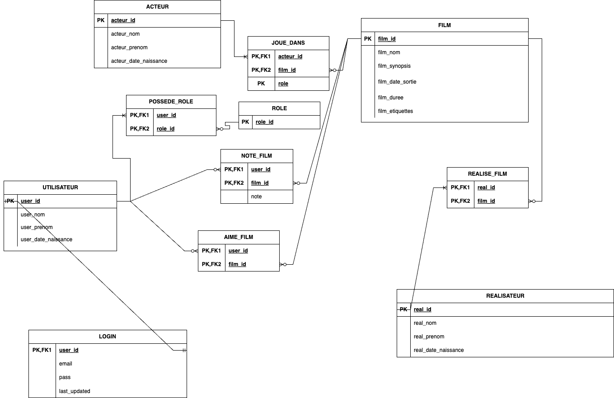
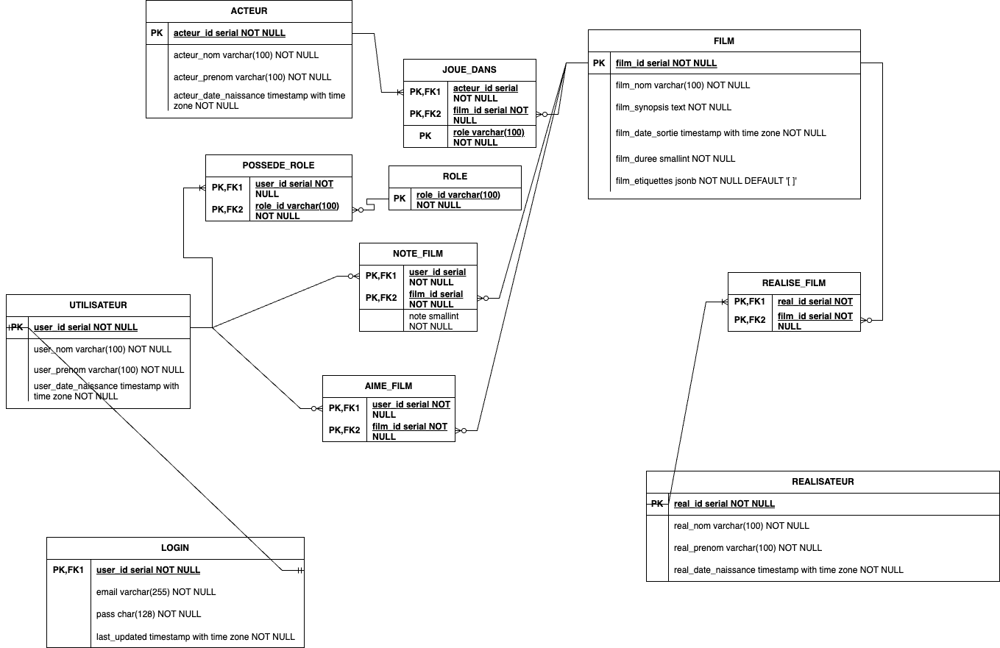

# TP 7

## Énoncé
En tant que développeur passionné par le cinéma, vous avez toujours été fasciné par la magie du grand écran. Cette passion ne se limite pas seulement à regarder des films. Vous avez toujours été curieux de connaître les coulisses, d'étudier qui a joué dans tel film, qui l'a réalisé, et comment ces chefs-d'œuvre ont été créés. Vous trouvez aussi que les plateformes de streaming sont un formidable accès à un catalogue d'oeuvres de toute sorte à découvrir.
Vous avez donc envie de créer, vous aussi, votre propre plateforme de streaming sur votre temps libre.
Mais comme Rome ne s'est pas construite en un jour, vous voulez commencer par la mise en place d'un site web permettant de procéder à différentes opérations de recherches à propos de films, d'acteurs/actrices ou de réalisateurs.
Vous avez donc besoin d'une base de données pour le stockage. Et donc de la concevoir et la mettre en place !

**Base de données postgresql**

## Dico de données
[Dico de données.xlsx](Dico%20de%20donn%C3%A9es.xlsx)
## MCD

## MLD

## MPD

